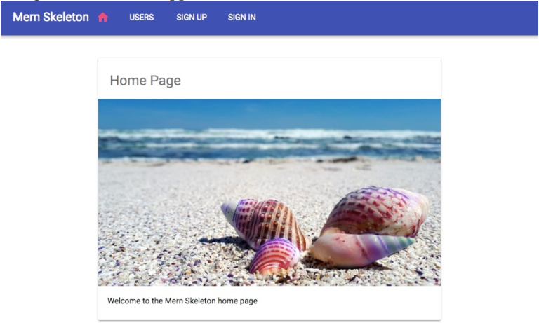

# Skeleton for backend
## Specs

- Sign up: Users can register by creating a new account using an email address
- User list: Any visitor can see the list of all registered users
- Authentication: Registered users can sign in and sign out
- Protected user profile: Only registered users can view individual user details after signing in
- Authorized user edit and delete: Only a registered and authenticated user can edit or remove their own user account details

## Install dev modules
- Install Babel modules as devDependencies

npm install --save-dev babel-core babel-loader babel-preset-env babel-preset-stage-2

npm install babel-loader@7

- Install Webpack bundle as devDependencies

npm install --save-dev webpack webpack-cli webpack-node-externals

- Install nodemon as devDependencies

 npm install --save-dev nodemon

- Install express

 npm install express

- Install body-parser

Body parsing middleware to handle the complexities of parsing streamable request objects, so we can simplify browser-server communication by exchanging JSON in the request body

npm install body-parser

- Install cookie-parser

Cookie parsing middleware to parse and set cookies in request objects

npm install cookie-parser

- Install compression

Compression middleware that will attempt to compress response bodies for all requests that traverse through the middleware
 
npm install compression


- Install helmet

A collection of middleware functions to help secure Express apps by setting various HTTP headers

npm install helmet

- Install CORS

Middleware to enable CORS (Cross-origin resource sharing)

npm install cors

- Install mongoose

npm install mongoose

- Install lodash

lodash is a JavaScript library which provides utility functions for common programming tasks including manipulation of arrays and objects

npm install lodash

- Install jsonwebtoken

npm install jsonwebtoken

- Install express-jwt

The express-jwt module is middleware that validates JSON Web Tokens

npm install express-jwt

# Test back-end

- Create user

POST localhost:3000/api/users

{
"name":"chi nguyen",
"email":"chivitc1@gmail.com",
"password":"abc123"
}

- Get list

GET localhost:3000/api/users

- Get one - code 401

GET localhost:3000/api/users/{userID}

- Signin - got token

POST localhost:3000/auth/signin

{
"email":"chivitc1@gmail.com",
"password":"abc123"
}

- Get one - code 200

GET localhost:3000/api/users/{userID}

# Front-end
## Specs
- Home page: A view that renders at the root URL to welcome users to the web application
- User list page: A view that fetches and shows a list of all the users in the database, and also links to individual user profiles
- Sign-up page: A view with a form for user sign-up, allowing new users to create a user account and redirecting them to a sign in page when successfully created
- Sign-in page: A view with a sign-in form that allows existing users to sign in so they have access to protected views and actions
- Profile page: A component that fetches and displays an individual user's information, is only accessible by signed-in users, and also contains edit and delete options, which are visible only if the signed-in user is looking at their own profile
- Edit profile page: A form that fetches the user's information in the form, allows them to edit the information, and is accessible only if the logged-in user is trying to edit their own profile
- Delete user component: An option that allows the signed-in user to delete only their own profile after confirming their intent
- Menu navigation bar: A component that lists all the available and relevant views to the user, and also helps to indicate the user's current location in the application

## Layout
```
--MainRouter
----Menu
----Home
----Signup
----Signin
----Users
----Profile
--------DeleteUser
----EditProfile
```

**MainRouter** will be the **root** React component that contains all the other custom React views in the application. **Home, Signup, Signin, Users, Profile, and EditProfile** will render at individual routes declared with React Router, whereas the **Menu** component will render **across all these views**, and **DeleteUser** will be a part of the **Profile view**.

## Install dependencies for front-end dev

- Install Babel React preset module

npm install babel-preset-react --save-dev

- Install webpack dev modules

npm install --save-dev webpack-dev-middleware webpack-hot-middleware file-loader

- Install react-hot-loader module

npm install react-hot-loader

- Install React

npm install react react-dom

- Install React Router

npm install react-router react-router-dom

- Install Material-UI components

npm install material-ui@1.0.0-beta.43

npm install material-ui-icons

- Install file-loader as dev dependency

npm install --save-dev file-loader

## Prototypes
- HomePage




